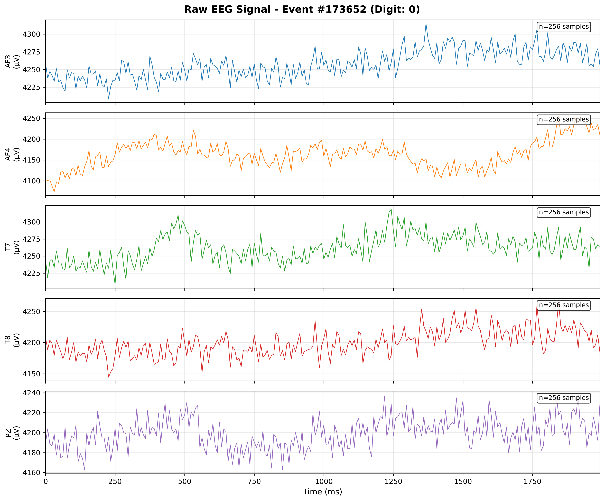
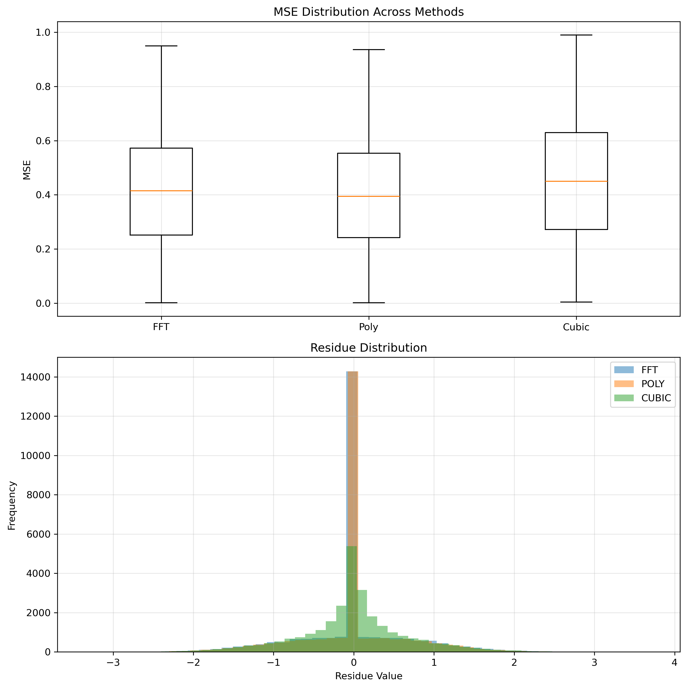

# dEEGit: EEG-Based Digit Classification using Deep Learning

A deep learning project that classifies digits (0-9) from EEG brain signals using a Convolutional Neural Network.

## Problem Statement

Can we decode what digit a person is viewing or thinking about purely from their brain activity?

This project uses EEG (electroencephalography) data recorded from 5 channels (`AF3`, `AF4`, `T7`, `T8`, `PZ`) while participants were exposed to digit stimuli. The goal is to build a neural network that can classify which digit (0-9) corresponds to a given EEG signal segment.

## The Data

Multichannel EEG recording of participants seeing or thinking of digits were acquired from MindBigData's open dataset. [Dataset](https://mindbigdata.com/opendb/index.html)

Below is an example of what a raw EEG recording looks like across all 5 channels for a single event (digit stimulus):

Each subplot shows one electrode channel:
- **AF3 / AF4**: Frontal electrodes (left/right hemisphere)
- **T7 / T8**: Temporal electrodes (left/right hemisphere)
- **PZ**: Parietal midline electrode

The x-axis shows time in milliseconds (~2 seconds of recording), and the y-axis shows voltage in microvolts (μV). The EEG data was recorded at **128 Hz** for approximately **2 seconds** per trial. In theory, this should yield exactly **256 samples** per channel per event.

However, real-world data collection is rarely perfect. Due to timing variations in the recording equipment the actual sample counts varied across events. Some recordings had 240 samples, others had 260, 270 etc.

Since neural networks require fixed-size inputs. We cannot feed tensors of shape `(N, 5, 240)` and `(N, 5, 270)` into the same model; the architecture expects a consistent input dimension.

To standardize all recordings to exactly **256 samples**, we need to resample the signals. But which resampling method preserves the EEG signal characteristics best? Poor resampling could introduce artifacts, distort frequency content, or lose critical temporal information.

I evaluated three resampling methods:

1. **FFT-based resampling** (`scipy.signal.resample`) - Uses Fourier transform to resample in the frequency domain
2. **Polyphase filtering** (`scipy.signal.resample_poly`) - Uses an efficient polyphase filter implementation
3. **Cubic Spline interpolation** (`scipy.interpolate.CubicSpline`) - Fits a smooth cubic polynomial through the data points

## Resampling Method Comparison

### Methodology

To fairly evaluate each resampling method, we designed a controlled experiment:

1. **Start with ground truth**: Use signals that are already 256 samples
2. **Downsample**: Reduce to 128 samples using simple decimation (taking every 2nd sample)
3. **Reconstruct**: Upsample back to 256 samples using each method
4. **Compare**: Measure how well the reconstruction matches the original

This approach ensures the downsampling is identical for all methods, isolating the reconstruction quality of each resampling algorithm.

#### Metrics Used:
- **Mean Squared Error (MSE)**: Quantifies the average squared difference between original and reconstructed signals
- **Residue**: The point-wise difference between original and reconstructed signals, showing where and how errors occur

### Results

| Method | Mean MSE | Mean Residue | Std Residue |
|--------|----------|--------------|-------------|
| **FFT** | 0.392408 | 0.358212 | 0.626424 |
| **Polyphase** | **0.373147** | **0.351161** | **0.610857** |
| **Cubic Spline** | 0.436911 | 0.454456 | 0.660992 |

### Visual Analysis

#### MSE and Residue Distribution Comparison

The figure above shows:
- **Top**: Box plot of MSE distribution across all samples for each method
- **Bottom**: Histogram of residue values showing error distribution

### Key Findings

1. **Polyphase filtering performs best** with the lowest MSE (0.373) and tightest residue distribution (std: 0.611)

2. **FFT resampling is a close second**, with slightly higher MSE (0.392) and higher residue distribution (std: 0.626)

3. **Cubic Spline interpolation performs worst**, with the highest MSE (0.437) and largest residue spread (std: 0.661)

### Why Polyphase Wins

Polyphase filtering is specifically designed for sample rate conversion. It applies an anti-aliasing filter during the resampling process, which:
- Prevents high-frequency aliasing artifacts
- Preserves the frequency content within the Nyquist limit
- Uses efficient computation through polyphase decomposition

FFT resampling assumes the signal is periodic (which EEG signals are not), leading to edge effects. Cubic spline interpolation, while smooth, doesn't account for the frequency content and can introduce oscillations.

**Decision**: Based on this analysis, **polyphase resampling** (`resample_poly`) was selected for the preprocessing pipeline.

## Data Pipeline

### 1. Parsing (`parse.py`)

The raw data file is tab-separated with the following structure:
- Event ID
- Database identifier
- Channel name
- Digit label (0-9)
- Sample count
- Raw signal values (comma-separated)

The parser:
- Filters by database and minimum length requirements
- Validates that events have exactly 5 channels
- Handles duplicate channels and inconsistent digit labels by marking events as invalid

### 2. Preprocessing (`parse.py`)

After parsing, each signal undergoes:

1. **Resampling**: Variable-length signals → 256 samples using polyphase filtering
2. **Z-score normalization**: For each channel independently

This ensures:
- Zero mean (centered around 0)
- Unit variance (consistent scale)
- Optimal conditions for neural network training

### 3. Tensor Conversion (`parse.py`)

The processed data is converted to tensors:
- **X**: Shape `(N, 5, 256)` - N samples, 5 channels, 256 time points
- **y**: Shape `(N,)` - Digit labels (0-9)

### 4. Dataset Splitting (`dataset.py`)

Data is split stratified by label:
- **Training**: 70%
- **Validation**: 15%
- **Testing**: 15%

## Model Architecture (Current Stage)

The model is currently being built on a **temporal-spatial convolutional architecture** designed for multi-channel EEG data:

- **Temporal convolutions**: Extract features along the time dimension within each channel
- **Spatial convolutions**: Learn relationships between different electrode positions
- **Classification head**: Dense layers mapping learned features to 10 digit classes

## License

This project is for educational and research purposes.
